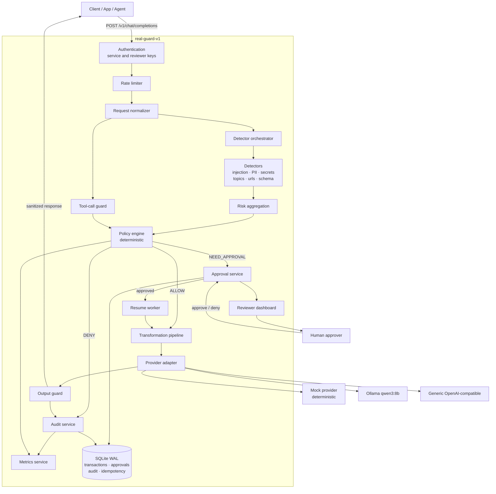
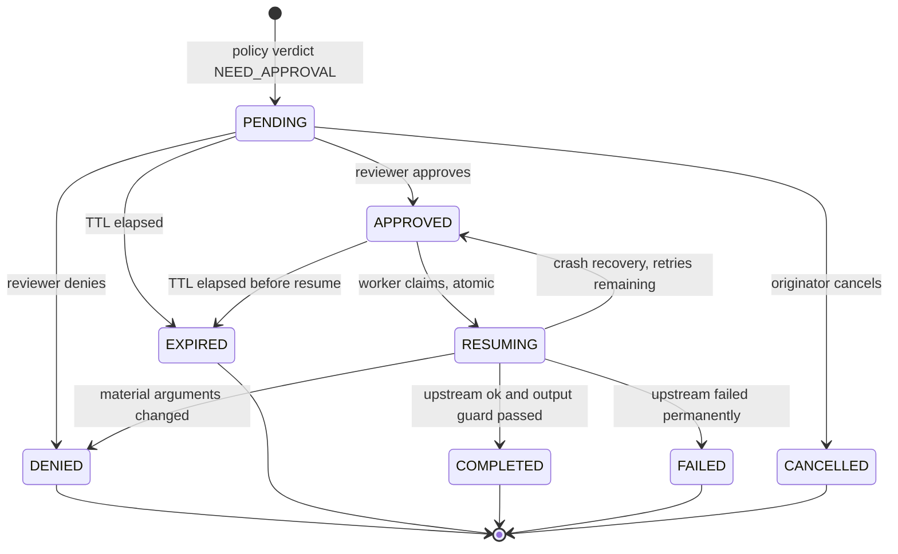

# Architecture

This document expands on [`SPEC.md` §1.4](../SPEC.md#14-architecture) (the
normative architecture diagram) and [§2](../SPEC.md#2-component-specification)
(the nineteen-component specification). It is synthesis and organization of
already-agreed content, not a new source of requirements — where this
document and `SPEC.md` appear to disagree, `SPEC.md` wins (see the repository
root `README.md`'s governing-rules note). Component-level detail, including
what each component must not do and how it fails, lives in `SPEC.md` §2 and
is not repeated here in full.

## System diagram

**Reading the diagram:** the only path from `Pol` (policy engine) to `Prov`
(provider adapter) runs through `Trn` (transformation pipeline), and the
only path from `Prov` to `Client` runs through `OG` (output guard). Those two
structural facts are `SYS-002` (no upstream call on `DENY` or
`NEED_APPROVAL`) and `SYS-003` (every response passes the output guard) —
they are enforced by the shape of the call graph, not by a runtime check
that could be bypassed.

## The five inspection planes

Every detector runs against one of five planes (`SPEC.md` §2.2/§6), and a
policy rule declares which plane(s) it applies to (`POL-017`):

| Plane | What it inspects | Trust posture |
|---|---|---|
| **input** | The caller's own message content | Authenticated by a service key, but never trusted as safe content (`TB1`) |
| **context** | Retrieved documents, tool results, or replayed prior messages carried in the request | **Fully untrusted**, even inside an authenticated request (`TB2`) — an indirect-injection detector runs here with a lower deny threshold than the input plane's own |
| **action** | Parsed `tools[]` declarations and `tool_calls[]` | Inspected, never executed — the firewall asks the provider for a text completion only, it never calls a tool itself (`SYS-009`) |
| **response** | The upstream provider's completion, before it reaches the client | Runs after every upstream call, on every return path, via the output guard (`SYS-003`, `SYS-014`) |
| — | Rate limiting, payload size, and schema validation | Not plane-scoped; enforced before detection runs at all |

The input/context split is what makes indirect prompt injection (a
malicious instruction planted in a document a retriever fetched, rather than
typed by the user) a first-class, separately-thresholded concern rather than
an afterthought — see `IND-001` through `IND-004` in the golden corpus and
`THR-002` in the threat model.

## Request lifecycle

1. **Authentication** (`app/auth.py`) resolves an identity class (service or
   reviewer) from the `Authorization` header or, for the dashboard, a
   session cookie. Identity is never taken from a client-supplied header
   alone (`SEC-009`).
2. **Rate limiting** (`app/ratelimit.py`) checks a fixed-window counter
   scoped to the identity before any detection work begins.
3. **Normalization** (`app/normalizer.py`) produces a `NormalizedTransaction`
   — NFKC normalization, zero-width/bidi stripping, homoglyph folding,
   bounded-depth base64/hex/URL decoding (`SYS-012`: default depth 3) — for
   **detection only**. The payload actually forwarded upstream is never
   mutated by this step (`SPEC.md` §2.2).
4. **Detector orchestration** (`app/detectors/`, `app/orchestrator.py`) runs
   the active detector set concurrently per plane, isolating any detector
   that raises or exceeds its deadline (`DET-014`) and marking the
   transaction degraded rather than failing the whole request.
5. **Risk aggregation** (`app/risk.py`) reduces findings to a per-category
   score and an overall `risk_level`. This is evidence for the policy
   engine and for human readers — it never authorizes anything by itself
   (`POL-012`).
6. **Policy evaluation** (`app/policy.py`, `app/decision.py`) is a
   deterministic reduction of findings, tool analysis, and rate-limit state
   against `policies/default_policy.yaml` to one verdict — `ALLOW`, `DENY`,
   or `NEED_APPROVAL` — with named policy hits (`POL-001`, `POL-002`). The
   same input, policy, and detector versions always produce the same
   verdict; there is no randomness and no LLM in the decision path.
7. **Branch on verdict:**
   - `DENY` → an audit event is written; no upstream call is made; the
     client gets a `403` (or a `409`/other error-taxonomy status for
     specific rule types) with no echo of the offending content
     (`API-009`).
   - `NEED_APPROVAL` → the transformation pipeline produces a sanitized
     preview, an approval row is durably persisted (`APR-005`, *before* the
     `202` is returned), and the request is held. No upstream call and no
     external side effect happens until a human decides (`APR-002`). See
     "The approval state machine" below.
   - `ALLOW` → the transformation pipeline applies any configured
     transformation (e.g. `REDACT`) to produce the payload actually sent
     upstream, orthogonally to the fact that it was authorized (`TRN-001`).
8. **Provider adapter** (`app/providers/`) sends the (possibly transformed)
   request to whichever provider is configured — `MockProvider` (default),
   `OllamaProvider`/`OpenAICompatibleProvider` (the same adapter code;
   Ollama is configuration of it, not a separate implementation), or any
   other OpenAI-compatible endpoint.
9. **Output guard** (`app/outputguard.py`) inspects the provider's response
   — PII, secrets, system-prompt-leak similarity, and canary-token
   detection — before the client ever sees it, on **every** return path,
   including the approval-resume path (`SYS-014`, one shared function).
   It may `DENY` (the response is discarded, never delivered) or `ALLOW`
   with `REDACT` applied.
10. **Audit** (`app/audit.py`) writes exactly one hash-chained `decision`
    event per verdict (`PRV-009`), plus `APPROVAL_*` lifecycle events for
    the approval path. **Metrics** (`app/metrics.py`) records Prometheus
    counters/histograms for the same transaction.

## The approval state machine

Every transition is a single atomic write guarded by the expected current
state, under `BEGIN IMMEDIATE` (`APR-004`) — this is what makes a 20-way
concurrent decide-and-resume race resolve to exactly one winner
(`APR-011`, `tests/test_approvals_engine.py`) rather than a double-resume.
Any transition not drawn above is rejected with `409` and mutates nothing
(`APR-001`, `APR-003`); a resumed approval's tool-call arguments are
re-validated against a hash taken at creation time, so approving a wire
transfer for \$5,000 does not silently authorize a request whose arguments
changed to \$50,000 between creation and decision (`APR-013`, `THR-012`).
See `docs/adr/0004-approval-workflow-mvp.md` for the full design history and
`docs/adr/0006-reviewer-dashboard-session-auth-and-csrf.md` for how the
dashboard's own decision route reuses the identical
`app/approvals.decide_and_resume()` function the canonical JSON endpoint
uses.

## Data model

Persistence is SQLite in WAL mode via SQLAlchemy 2.0, chosen for precise
transaction control (exactly-once resume needs `BEGIN IMMEDIATE`, not just
"a database") and concurrent-reader support without a separate server
process. The MVP is explicitly single-instance (PLAN.md's non-goals) — no
Postgres, no Redis, no multi-instance coordination. Core tables: `transactions`,
`approvals`, `audit_events` (append-only, hash-chained — see "Audit chain
integrity" below), `rate_limit_state`, and `idempotency_records`. Two tables
SPEC.md §10 describes remain unimplemented as of Phase 7 — `detector_findings`
and a normalized `policy_hits` table — because no automated check this
project has run through Phase 7 requires them; content is retained inline on
the transaction row instead, gated by `CONTENT_RETENTION`.

## Audit chain integrity

Every `audit_events` row carries `event_hash = sha256(prev_hash || payload)`,
chaining each event to the one before it (`DAT-005`). This makes tampering
**evident** — altering or deleting a row breaks the chain from that point
forward, and `tests/test_audit_privacy.py`/the export tooling can detect
that — but it is not tamper-**proof**: anyone with direct write access to the
SQLite file can, in principle, rewrite the entire chain consistently. See
`SECURITY.md` for this caveat stated without hedging, and `docs/threat-model.md`
(`THR-014`) for the boundary it sits behind.

## Provider abstraction and the mock-first design

`app/providers/` defines one adapter interface with three implementations:
`MockProvider` (deterministic, no network, the default — see the README's
"Mock mode" section for why), `OllamaProvider`/`OpenAICompatibleProvider`
(one real implementation; Ollama is a configuration profile of it, not
separate code — `UPSTREAM_BASE_URL` pointed at a local Ollama vs. any other
OpenAI-compatible endpoint), and the seam is deliberately narrow: swapping
providers changes zero policy, detector, or transformation code. This is
`DEP-001`'s "local-first and provider-agnostic" principle applied literally
— the full pipeline runs offline on a laptop with no paid key, and a real
provider is an adapter, not an assumption baked into the request path.

## Documented migration paths (not built, not required for the MVP)

PLAN.md §8 lists several components deliberately kept out of the MVP because
a validated YAML policy schema, a regex/heuristic detector set, and SQLite
already satisfy every current requirement, each reachable through an
existing interface seam rather than a redesign:

| Component | Would replace | Interface seam already in place |
|---|---|---|
| OPA / Rego | The YAML+JSON-Schema policy engine (`app/policy.py`) | Policy evaluation already takes a normalized findings list and returns a verdict — a Rego-backed implementation could sit behind the same function signature |
| Microsoft Presidio | The regex-based PII detector (`app/detectors/pii.py`) | The detector interface (`app/detectors/base.py`) is a pure function from normalized text to `list[Finding]`; any implementation satisfying that signature is a drop-in |
| An ML injection classifier (DeBERTa / Llama Prompt Guard via Ollama) | The regex-based injection detector | Same detector interface; a model-backed detector is still a pure function returning `Finding`s, with its own timeout budget |
| LiteLLM | `app/providers/openai_compatible.py` | The provider adapter interface already abstracts "send a chat completion request, get one back" |
| Redis | The in-process rate limiter and any future cache | Rate-limit state is already isolated behind `app/ratelimit.py`'s own read/write calls, not inlined into request handling |
| PostgreSQL | SQLite (WAL) | SQLAlchemy 2.0's engine abstraction is already the persistence layer; swapping the connection string is the bulk of the work, migrations aside |

None of these is needed by anything in this MVP's requirement set today —
see PLAN.md §8's "Deliberately not mandatory" note for the reasoning behind
each.

## Related documents

- [`SPEC.md`](../SPEC.md) — the normative contract this document expands on.
- [`PLAN.md`](../PLAN.md) — build sequencing and the technology-decisions
  table (§8) this document's migration-path section restates.
- [`docs/threat-model.md`](threat-model.md) — assets, trust boundaries,
  threat actors, and the threats-and-controls table this architecture
  implements controls for.
- [`docs/adr/`](adr/) — the reasoning behind every deviation from, or
  completion of, the literal SPEC/PLAN text.
